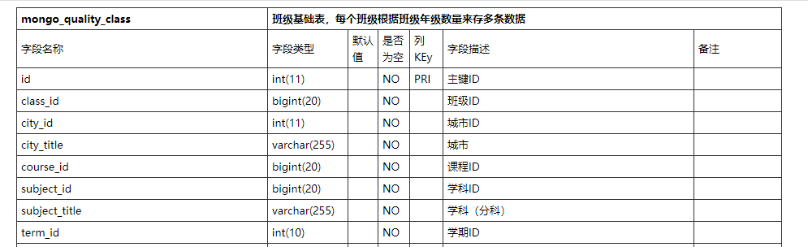

#### db_schema
本项目主要是生成Mysql的表结构，返回Html，可以自定义显示table样式。

#### 安装
```bash
composer require sclzzhanghaijun/db_schema
```

#### 使用
```php
//首先需要实现一个接口，返回结果必须是数组
class TestSchema implements \SCLZZHJ\Schema\SchemaInterFace
{
    public function SqlExec($sql)
    {
        if (strstr($sql, "`TABLES`") !== false) {
            return [
                ['TABLE_NAME' => 'table_1', 'TABLE_COMMENT' => '表1'],
                ['TABLE_NAME' => 'table_2', 'TABLE_COMMENT' => '表2'],
            ];
        } else if (strstr($sql, "`COLUMNS`")) {
            return [
                ['COLUMN_NAME' => 'column_1', 'COLUMN_COMMENT' => '列1', 'COLUMN_TYPE' => 'varchar'],
                ['COLUMN_NAME' => 'column_2', 'COLUMN_COMMENT' => '列2', 'COLUMN_TYPE' => 'int'],
                ['COLUMN_NAME' => 'column_3', 'COLUMN_COMMENT' => '列3', 'COLUMN_TYPE' => 'text'],
            ];
        }
        throw new SCLZZHJ\Schema\SchemaException("错误的查询");
    }
}

//调用
$schema = new SCLZZHJ\Schema\Schema(new TestSchema(), "name");

try {
    $table = $schema->make();
    $html = <<<EOF
    <html lang="zh">
    <meta http-equiv="Content-Type" content="text/html; charset=utf-8" />
    <style ="text/css">
    /*table start*/  
    table{  
        /* -moz-border-radius: 5px;  
        -webkit-border-radius:5px;  
        border-radius:5px; */  
        margin: auto;
        width: 50%;  
        border:solid #333;   
        border-width:1px 0px 0px 1px;  
        font-size: #333;  
        border-collapse: collapse;  
        border-spacing: 0;  
        font-size: 13px;
    }  
    table tbody tr{  
        height: 20px;  
        line-height: 20px;  
    }  
    table tbody tr.odd{  
        background-color: #fff;  
    }  
    table tbody tr.even{  
        background-color: #F5F5F5;  
    }  
    table tbody tr:hover{  
        background-color: #eee;  
    }  
    table tbody tr th,table tbody tr td{  
        padding:3px 5px;  
        text-align: left;  
        /* border: 1px solid #ddd; */  
        border:solid #333;   
        border-width:0px 1px 1px 0px;   
    }  
    table tbody tr th{  
        font-weight: bold;  
        text-align: center;  
    }  
    table tbody tr td a:hover{  
        color:#0080c0;  
    }  
    /*table end*/ 
</style>
EOF;
    $html .= "<body>" . $table . "</body></html>";
    file_put_contents("../index.html", $html);
} catch (\Exception $exception) {
    echo $exception->getMessage();
}
```

### 最终效果
